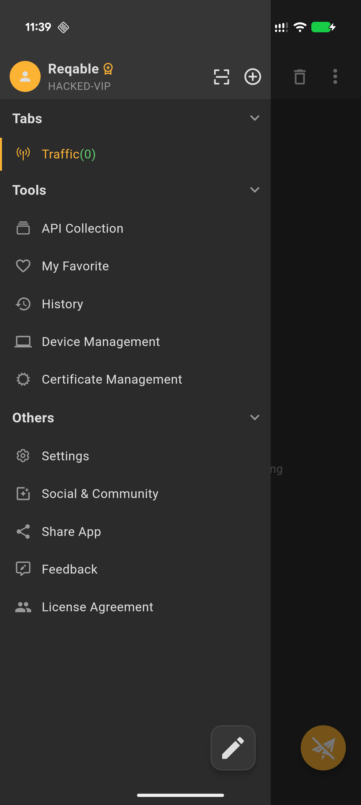
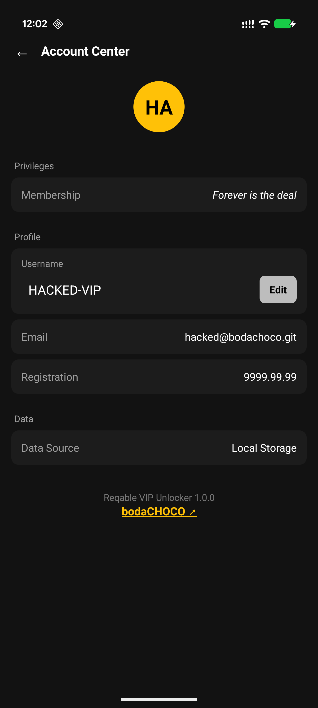

# Reqable VIP Unlocker

Lifetime VIP for Reqable.

  
  &nbsp;
  
  &nbsp;
  

---

### Before

  
  &nbsp;&nbsp;&nbsp;&nbsp;&nbsp;&nbsp;
  

---

### After

  
  &nbsp;&nbsp;&nbsp;&nbsp;&nbsp;&nbsp;
  

---

### Prerequisites

- Root + **LSPosed** (Zygisk)
- **arm64** device
- **Reqable** for Android

Verified on **3.2.14** — other versions should work. If one doesn’t, [open an issue](https://github.com/bodachoco/Reqable-VIP-Unlocker/issues/new?template=bug_report.yml).

### Install

1. Install **Reqable**  
   Don’t have it? Grab [`Reqable-3.2.14-arm64.apk`](https://github.com/bodachoco/Reqable-VIP-Unlocker/releases/latest) from the release (separate download).
2. Install [`ReqableVipUnlocker-1.0.0.apk`](https://github.com/bodachoco/Reqable-VIP-Unlocker/releases/latest)
3. **LSPosed** → enable → scope **Reqable**
4. **Reboot**, then open Reqable once with internet

### Uninstall

Disable or remove the module in LSPosed, then reboot.
