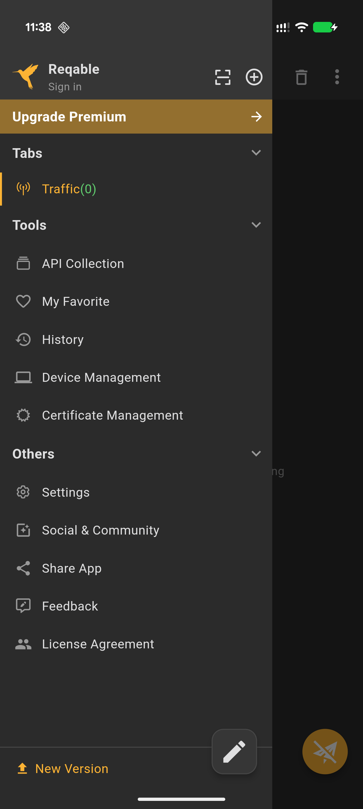
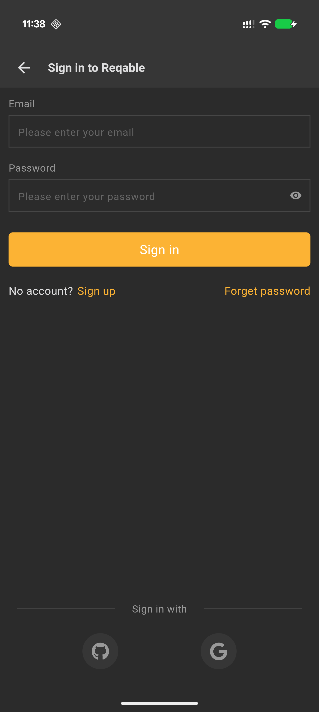
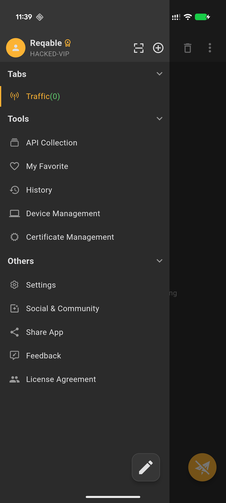
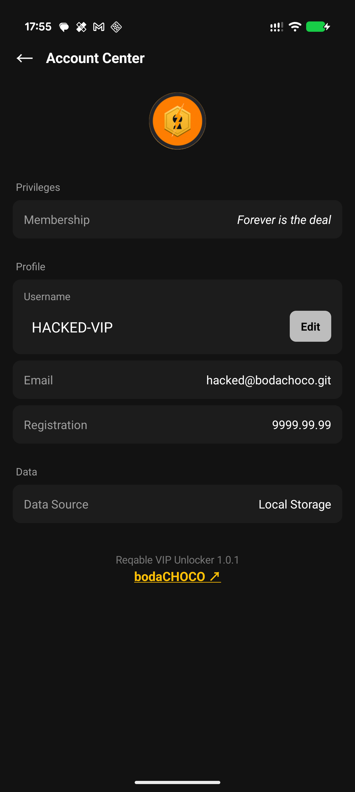

# Reqable VIP Unlocker

Lifetime VIP for Reqable. *(Unpatchable)*

  
  &nbsp;
  
  &nbsp;
  

  
  &nbsp;
  

BTC address

`bc1qm35fzw9e5d5558gn6k4746f2nhvzu00lpjd2v6`

---

### Before

  
  &nbsp;&nbsp;&nbsp;&nbsp;&nbsp;&nbsp;
  

---

### After — Global

  
  &nbsp;&nbsp;&nbsp;&nbsp;&nbsp;&nbsp;
  

---

### After — Chinese

  
  &nbsp;&nbsp;&nbsp;&nbsp;&nbsp;&nbsp;
  

---

### Prerequisites

- Root + **LSPosed** (Zygisk)
- **arm64** device
- **Reqable** for Android

Works on **global and Chinese** Reqable builds (**3.2.16**, also checked on **3.2.14**). If yours doesn’t, [open an issue](https://github.com/bodachoco/Reqable-VIP-Unlocker/issues/new/choose) and **specify your region / store version**.

### Install

1. Install [Reqable from the Play Store](https://play.google.com/store/apps/details?id=com.reqable.android) *(or your regional / Chinese store build)*
2. Install [`ReqableVipUnlocker-1.0.1.apk`](https://github.com/bodachoco/Reqable-VIP-Unlocker/releases/latest)
3. **LSPosed** → enable → scope **Reqable**
4. **Reboot**, then open Reqable once with internet

### Uninstall

Disable or remove the module in LSPosed, then reboot.
